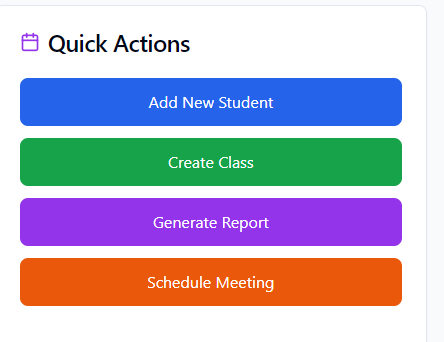
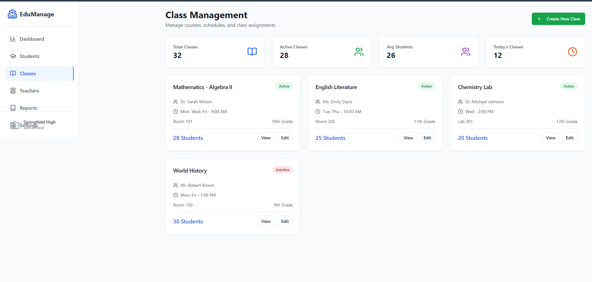

# School Space System

A modern school management platform built with React, Vite, Tailwind CSS, and Node.js/Express backend. It features authentication, dashboards, student/class/teacher management, quick actions, and report generation.

---

## Features
- **Login & Signup**: Secure authentication for users
- **Dashboard**: Overview of school stats, charts, and quick actions
- **Student Management**: Enroll, view, and manage students
- **Class Management**: Create and manage classes
- **Teacher Management**: Assign and manage teachers
- **Reports & Analytics**: Generate and preview academic, attendance, and enrollment reports
- **Quick Actions**: Add students, create classes, generate reports, schedule meetings

---

## Screenshots

### Login Page


### Signup Page


### Dashboard


### Quick Actions


### Student Management


### Class Management


### Teacher Management


### Reports & Analytics


### Schedule Meeting Modal


---

## Getting Started

1. **Install dependencies**
   ```sh
   npm install
   cd server
   npm install
   ```
2. **Start backend**
   ```sh
   cd server
   npm start
   ```
3. **Start frontend**
   ```sh
   npm run dev
   ```
4. **Access the app**
   - Frontend: [http://localhost:8081](http://localhost:8081)
   - Backend: [http://localhost:5001](http://localhost:5001)

---

## API Endpoints
- `POST /api/signup` — User registration
- `POST /api/login` — User login
- `POST /api/student` — Add new student
- `POST /api/class` — Create class
- `GET /api/report` — Generate report
- `POST /api/meeting` — Schedule meeting

---

## Technologies Used
- React
- Vite
- Tailwind CSS
- Node.js
- Express
- JWT Authentication

---

## License
MIT

---

> **Note:** Add your actual screenshots to the `screenshots/` folder for images to display in this README.
